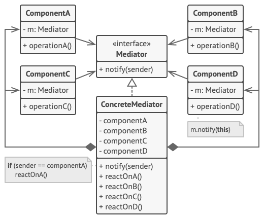

# Mediator Design Pattern

## Definition

Mediator is a behavioral design pattern that lets you reduce chaotic dependencies between objects. The pattern restricts direct communications between the objects and forces them to collaborate only via a mediator object.
Like a control tower. It makes tight coupling between Mediator and components.

## Example
### Note making desktop application

Editor class implements Mediator interface and register all components. All possible actions were mentioned in the Mediator interface and are managed in its child - Editor class.

The below diagram is not fully corresponding to the example. Replace AuthDialog with Editor class.

## Other

- Example is from awesome website [Refactoring Guru](https://refactoring.guru)